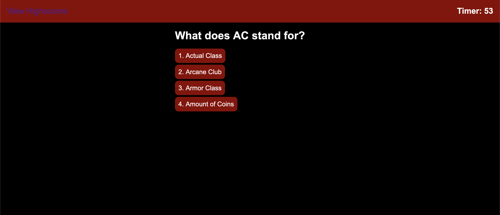

# D&D Quiz

## Description

https://antced.github.io/dnd-quiz/

JavaScript based Dungeons & Dragons quiz that includes the following features:

- Start button
- Answer buttons
- 5 unique questions
- Text that indicates if answers were right or wrong
- A timer
- Wrong answers subtract time
- Highscore submission
- Local storage of highscores

## Usage

- Click the start button to begin the quiz.
- Click on an answer.
- Submit your high score if you finish before the time runs out.

## Credits

Worked on as a project for UPENN's coding bootcamp under the instruction of Leif Hetland.
